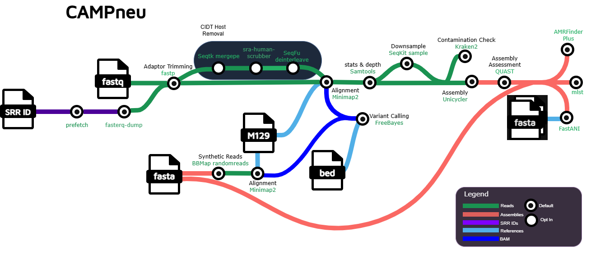

# CDCgov/CAMPneu

<!--  Uncomment when implemented [](https://www.nf-test.com)   -->

[](https://www.nextflow.io/)
[](https://github.com/nf-core/tools/releases/tag/3.5.1)
[](https://www.docker.com/)
[](https://sylabs.io/docs/)
[](https://cloud.seqera.io/launch?pipeline=https://github.com/CDCgov/CAMPneu)

## Introduction

**CDCgov/CAMPneu** is a bioinformatics pipeline that analyzes Mycoplasma pneumoniae culture independent and cultured isolate WGS sequencing data. It performs preprocessing on the reads, mapping to an Mp reference, assembly, P1 typing, sequence typing, and variant calling for antibiotic resistance characterization.

>[!NOTE]
>This repository is still under development and does not have complete documentation

<center></center>

Default analysis steps:  

1. Adaptor trimming and quality filtering ([`fastp`]())
2. Map reads to a reference ([`Minimap2`]())
3. Generate statistics on the alignment ([`Samtools stats`]())
4. Determine the depth of coverage of each position in the reference ([`Samtools depth`])
5. Perform De novo assembly ([`Unicycler`]())
6. Generate assembly quality metrics ([`QUAST`]())
7. Perform contamination check ([`Kraken2`]())
8. Determine average nucleotide identity between sample assemblies and P1 type references ([`FastANI`]())
9. Perform multilocus sequence typing with assemblies ([`mlst`]())
10. Generate index of reference genome ([`Samtools faidx`]())
11. Perform variant calling using alignment to reference genome ([`FreeBayes`]())
12. Perform general antimicrobial resistance characterization on assemblies ([`AMRFinderPlus`]())
13. Present output ([`MultiQC`](http://multiqc.info/))

## Usage

> [!NOTE]
> If you are new to Nextflow and nf-core, please refer to [this page](https://nf-co.re/docs/usage/installation) on how to set-up Nextflow. Make sure to [test your setup](https://nf-co.re/docs/usage/introduction#how-to-run-a-pipeline) with `-profile test` before running the workflow on actual data.


First, prepare a samplesheet with your input data that looks as follows:

`samplesheet.csv`:

```csv
sample,fastq_1,fastq_2,fasta,sra_accession
AEG588A1,AEG588A1_S1_L002_R1_001.fastq.gz,AEG588A1_S1_L002_R2_001.fastq.gz,,
AEG588B2,,,AEG588B2_contigs.fa,
SRR32566410,,,,SRR32566410
```

Each row represents a pair of fastq files (paired end), or an assembly, or a pair of fastq files and an assembly, or an SRA SRR ID.  

The Kraken2 Standard database can be downloaded from [here](https://benlangmead.github.io/aws-indexes/k2)  
The AMRFinderPlus database can be downloaded using the following commands:  
(requires `wget` and `BLAST+`)
```bash
wget -e robots=off -r -np -nH --cut-dirs=6 -R index.html \
    https://ftp.ncbi.nlm.nih.gov/pathogen/Antimicrobial_resistance/AMRFinderPlus/database/4.2/2026-03-24.1/ 

makeblastdb -in AMRProt.fa -dbtype 'prot' -out AMRProt.fa
```


Now, you can run the pipeline using:  


```bash
nextflow run CDCgov/CAMPneu \
   -profile <docker/singularity/.../institute> \
   --input samplesheet.csv \
   --outdir <OUTDIR> \
   --kraken2db kraken2_Standard/ \
   --amrfinderplus_db AMRFinderPlus_db/ \
```

> [!WARNING]
> Please provide pipeline parameters via the CLI or Nextflow `-params-file` option. Custom config files including those provided by the `-c` Nextflow option can be used to provide any configuration _**except for parameters**_; see [docs](https://nf-co.re/docs/usage/getting_started/configuration#custom-configuration-files).

## Credits

CDCgov/CAMPneu was originally written by Kathryn Morin.

We thank the following people for their extensive assistance in the development of this pipeline:

Eungi Yang  
Yuan Li  
Mahika Kadam  
Will Overholt

## Contributions and Support

If you would like to contribute to this pipeline, please see the [contributing guidelines](.github/CONTRIBUTING.md).

## Citations

<!-- TODO nf-core: Add citation for pipeline after first release. Uncomment lines below and update Zenodo doi and badge at the top of this file. -->
<!-- If you use CDCgov/CAMPneu for your analysis, please cite it using the following doi: [10.5281/zenodo.XXXXXX](https://doi.org/10.5281/zenodo.XXXXXX) -->

<!-- TODO nf-core: Add bibliography of tools and data used in your pipeline -->

An extensive list of references for the tools used by the pipeline can be found in the [`CITATIONS.md`](CITATIONS.md) file.

This pipeline uses code and infrastructure developed and maintained by the [nf-core](https://nf-co.re) community, reused here under the [MIT license](https://github.com/nf-core/tools/blob/main/LICENSE).

> **The nf-core framework for community-curated bioinformatics pipelines.**
>
> Philip Ewels, Alexander Peltzer, Sven Fillinger, Harshil Patel, Johannes Alneberg, Andreas Wilm, Maxime Ulysse Garcia, Paolo Di Tommaso & Sven Nahnsen.
>
> _Nat Biotechnol._ 2020 Feb 13. doi: [10.1038/s41587-020-0439-x](https://dx.doi.org/10.1038/s41587-020-0439-x).

## Public Domain Standard Notice
This repository constitutes a work of the United States Government and is not
subject to domestic copyright protection under 17 USC § 105. This repository is in
the public domain within the United States, and copyright and related rights in
the work worldwide are waived through the [CC0 1.0 Universal public domain dedication](https://creativecommons.org/publicdomain/zero/1.0/).
All contributions to this repository will be released under the CC0 dedication. By
submitting a pull request you are agreeing to comply with this waiver of
copyright interest.

## License Standard Notice
The repository utilizes code licensed under the terms of the Apache Software
License and therefore is licensed under ASL v2 or later.

This source code in this repository is free: you can redistribute it and/or modify it under
the terms of the Apache Software License version 2, or (at your option) any
later version.

This source code in this repository is distributed in the hope that it will be useful, but WITHOUT ANY
WARRANTY; without even the implied warranty of MERCHANTABILITY or FITNESS FOR A
PARTICULAR PURPOSE. See the Apache Software License for more details.

You should have received a copy of the Apache Software License along with this
program. If not, see http://www.apache.org/licenses/LICENSE-2.0.html

The source code forked from other open source projects will inherit its license.

## Privacy Standard Notice
This repository contains only non-sensitive, publicly available data and
information. All material and community participation is covered by the
[Disclaimer](DISCLAIMER.md)
and [Code of Conduct](code-of-conduct.md).
For more information about CDC's privacy policy, please visit [http://www.cdc.gov/other/privacy.html](https://www.cdc.gov/other/privacy.html).

## Contributing Standard Notice
Anyone is encouraged to contribute to the repository by [forking](https://help.github.com/articles/fork-a-repo)
and submitting a pull request. (If you are new to GitHub, you might start with a
[basic tutorial](https://help.github.com/articles/set-up-git).) By contributing
to this project, you grant a world-wide, royalty-free, perpetual, irrevocable,
non-exclusive, transferable license to all users under the terms of the
[Apache Software License v2](http://www.apache.org/licenses/LICENSE-2.0.html) or
later.

All comments, messages, pull requests, and other submissions received through
CDC including this GitHub page may be subject to applicable federal law, including but not limited to the Federal Records Act, and may be archived. Learn more at [http://www.cdc.gov/other/privacy.html](http://www.cdc.gov/other/privacy.html).

## Records Management Standard Notice
This repository is not a source of government records, but is a copy to increase
collaboration and collaborative potential. All government records will be
published through the [CDC web site](http://www.cdc.gov).
